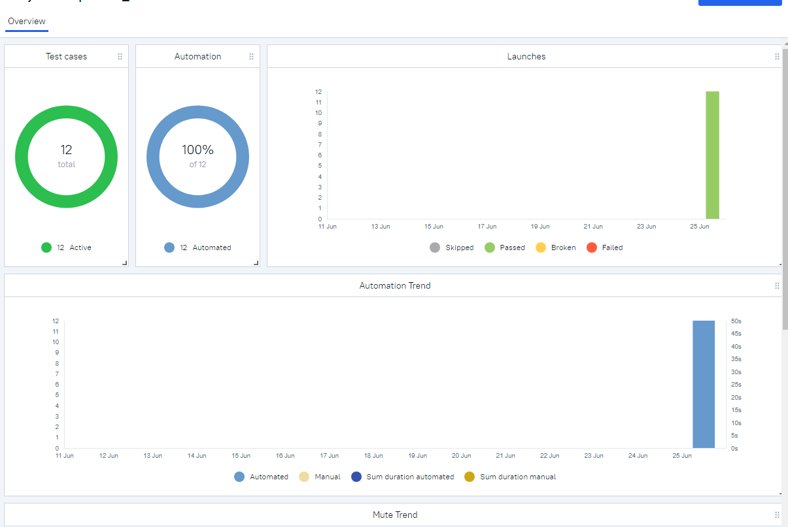
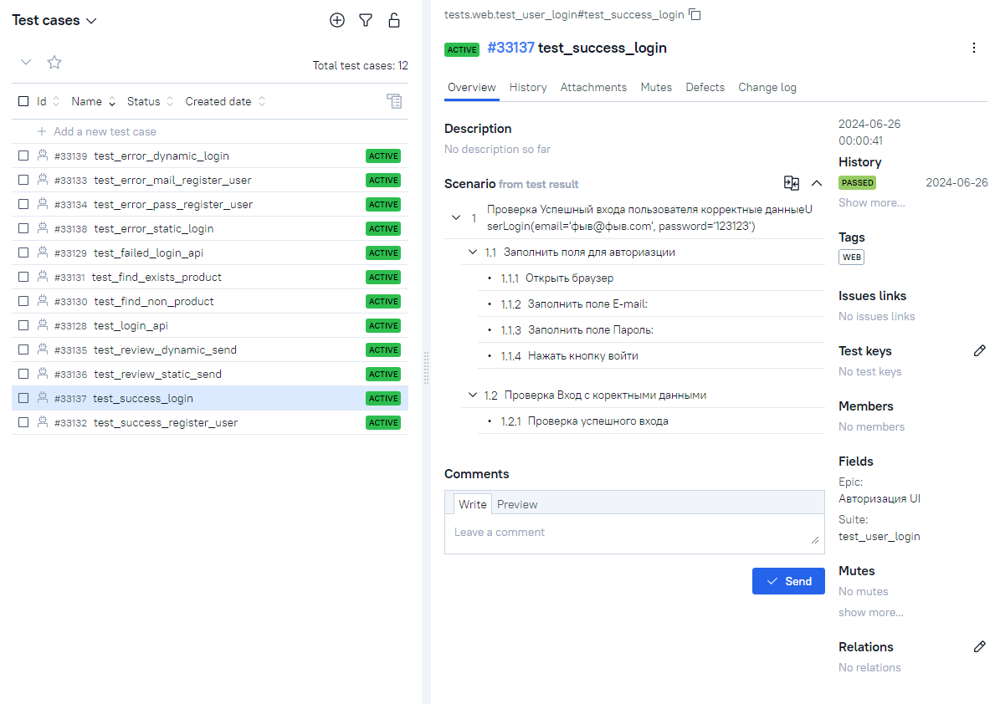
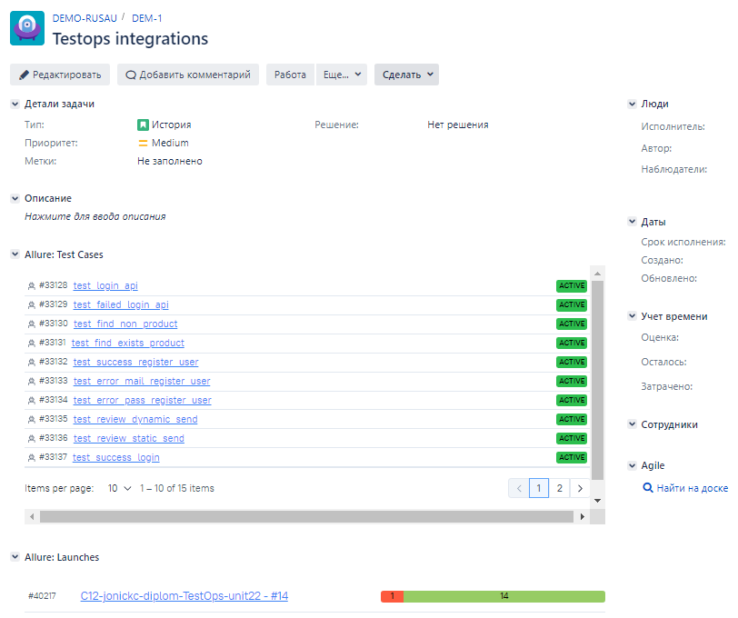

### Здравствуйте уважаемые посетители этого repo, тут расположен маленький проект автотестов ресурса sofrino.ru

> <a target="_blank" href="https://sofrino.ru/">sofrino.ru</a>

  
 #### Этот проект, дипломная работа по курсу QA.GURU | Python | Автоматизация тестирования 12 поток

В этом проект представлены демонстрационные тесты для практики и обучения на курсе.

#### Используемый стэк:

    
    
    
    
    
    
    
    

#### Cписко UI-автотестов в web:

- [x] [Страница поиск товара](tests/web/test_find_product.py) (позитив негатив)
-
    * Поиск существуюущего товара.(Ожидаем Успех)
-
    * Поиск не существуюущего товара. (Ожидаем Ошибку)
- [x] [Страница написать отзыв](tests/web/test_review.py) (позитив)
-
    * Отправка Отзыва со статичным текстом. (Ожидаем Успех)
-
    * Отправка Отзыва с динамическим текстом. (Ожидаем Успех)
- [x] [Страница Вход пользователя](tests/web/test_user_login.py) (позитив негатив)
-
    * Вход актуального пользователя. (Ожидаем Успех)
-
    * Вход не зарегистрированного пользователя статичные данные. (Ожидаем Ошибку)
-
    * Вход не зарегистрированного пользователя динамичные данные. (Ожидаем Ошибку)
- [x] [Страница Регистрация пользователя](tests/web/test_register_user.py) (позитив негатив)
-
    * Регистраиця сгенерированного пользователя. (Ожидаем Успех)
-
    * Регистраиця пользователя с не коректным e-mail. (Ожидаем Ошибку)
-
    * Регистраиця сгенерированного пользователя с пустым паролем. (Ожидаем Ошибку)

#### Cписко API-автотестов:

- [x] [Вход пользователя](tests/api/test_login.py) (позитив негатив)
-
    * Вход актуального пользователя. (Ожидаем Успех)
-
    * Вход актуального пользователя с не коректным паролем. (Ожидаем Ошибку)
- [x] [Получение корзины](tests/api/test_get_api.py) (позитив)
-
    * Получение корзины. (Ожидаем Успех)
- [x] [Получение формы отзыва](tests/api/test_get_api.py) (позитив)
-
    * Получение формы отзыва. (Ожидаем Успех)

#### Для локального автоматического запуска автотестов, запустить от администратора [starter.ps1](starter.ps1)

##### В cli PowerShell Выберете желаемые тесты введя цифру:

- [x] "1. Web"
- [x] "2. API"

<h3> Для локально ручного запуска автотестов:</h3>

<b>Запуск всех тестов</b>

<pre>
    pytest
</pre>

<b>Запуск web тестов</b>

<pre>
    pytest tests/web
</pre>

<b>Запуск API тестов</b>

<pre>
    pytest tests/api
</pre>

#### Для запуска автотестов в Jenkins

- [x] 
    1. Открыть <a target="_blank" href="https://jenkins.autotests.cloud/job/C12-jonickc-diplom-TestOps-unit22/">
       проект</a>
- [x] 
    2. Выбрать пункт Собрать
- [x] 
    2. Дождаться оповещения в Tелеграм [канал](https://t.me/+D-lMxBsV3vFhOWUy)
- [x] 
    3. Подробный отчет запуска смотреть в
       отчёте [Allure](https://jenkins.autotests.cloud/job/C12-jonickc-diplom-TestOps-unit22/allure/)

#### Пример визуальных отчетов:

- [x] Оповещение в Телеграм

    

- [x] Общий отчет

- [x] отчет кейса с ошибкой

- [x] отчет успешного кейса

- [x] Отчет в Allure TestOps

- [x] Пример ручных тест-кейсов в Allure TestOps

- [x] Пример интеграции с Jira

- [x] Видео пример успешного кейса регистрации пользователя

