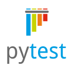
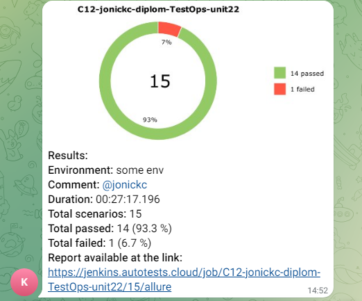
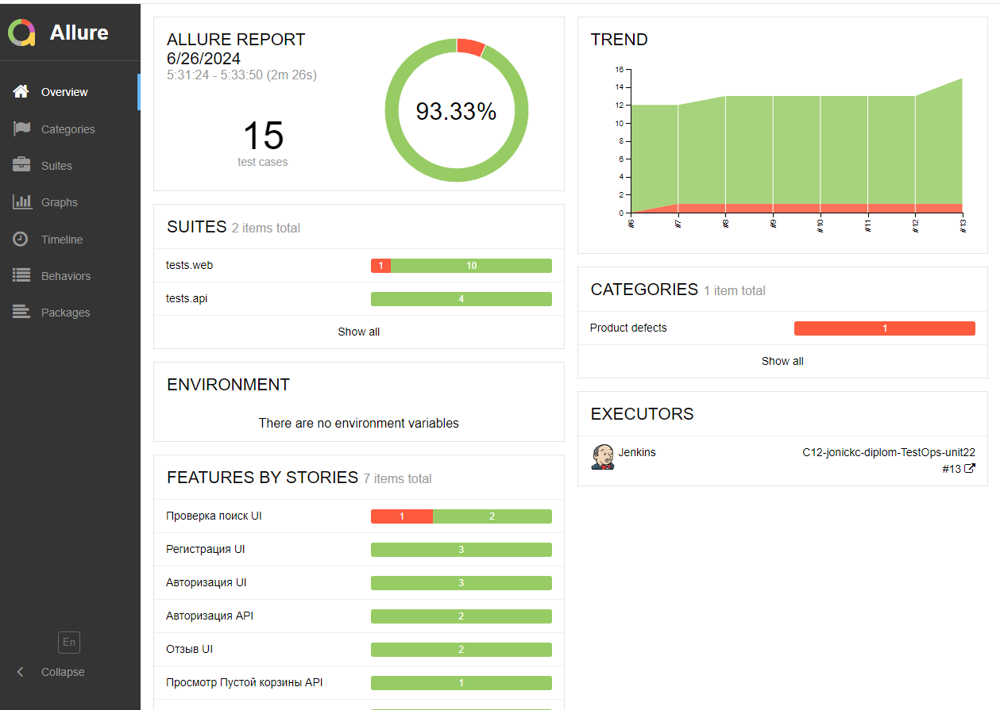
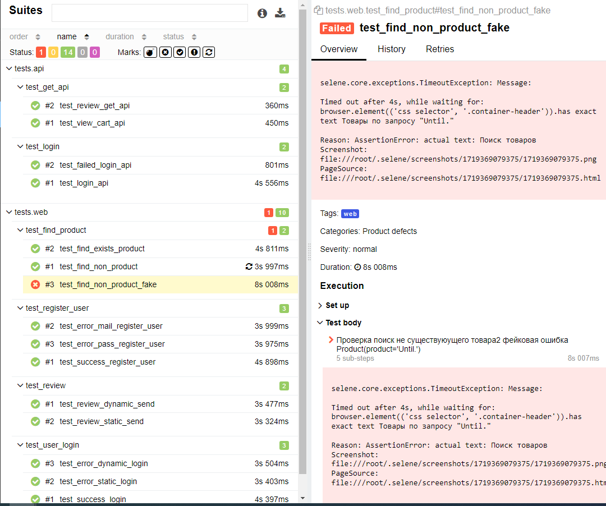
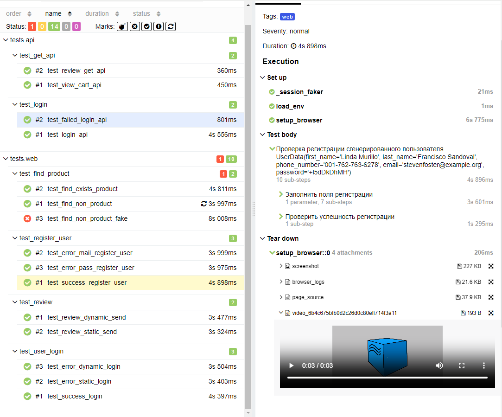

### Здравствуйте уважаемые посетители этого repo, тут расположен маленький проект автотестов ресурса sofrino.ru
> <a target="_blank" href="https://sofrino.ru/">sofrino.ru</a>

  
 #### Этот проект преддипломная работа по курсу QA.GURU | Python | Автоматизация тестирования 12 поток

В этом проект представлены демонстрационные тесты для практики и обучения на курсе.
Использованы простые функции заполнения форм, нажатия кнопок, поиска текста.
Проект структурирован по принципу 3-х уровней:

1. **Нижний уровень** где импортируется selene и объявляются локаторы и действия с локаторами.

2. **Средний уровень** где импортируется класс из нижнего уровня и составляются тест-кейсы.

3. **Верхний уровень** где импортируется класс из среднего уровня и выполняется тест-сьюты

##### При использование данной схемы легко дебажить ошибки тестов.

#### Используемый стэк:

    
    
    
    
    

#### Cписко UI-автотестов:

- [x] [поиск товара](tests/test_find_product.py) (позитив негатив) 
- [x] [написать отзыв](tests/test_review.py) (позитив)
- [x] [Вход пользователя](tests/test_user_login.py) (позитив негатив)
- [x] [Регистрация пользователя](tests/test_register_user.py) (позитив негатив)

#### Для локального автоматического запуска автотестов, запустить от администратора [starter.ps1](starter.ps1)

#### Для локально ручного запуска автотестов:

- [x] 1. Подготовить тестовую машину
- [x] 2. Склонировать репозиторий
- [x] 3. Установить зависимости
- [x] 4. Запустить в корневой директори pytest

#### Для запуска автотестов в Jenkins

- [x] 1. Открыть <a target="_blank" href="https://jenkins.autotests.cloud/job/C12-jonickc-sofrno_mini_test-unit14/">проект</a>
- [x] 2. Выбрать пункт Собрать
- [x] 2. Дождаться оповещения в Tелеграм [канал](https://t.me/+D-lMxBsV3vFhOWUy)  
- [x] 3. Подробный отчет запуска смотреть в отчёте [Allure](https://jenkins.autotests.cloud/job/C12-jonickc-sofrno_mini_test-unit14/3/allure)

#### Пример визуальных отчетов:

- [x] Оповещение в Телеграм

    

- [x] Общий отчет

    

- [x] отчет кейса с ошибкой

    

- [x] отчет успешного кейса

    

- [x] Видео пример успешного кейса регистрации пользователя 

    

